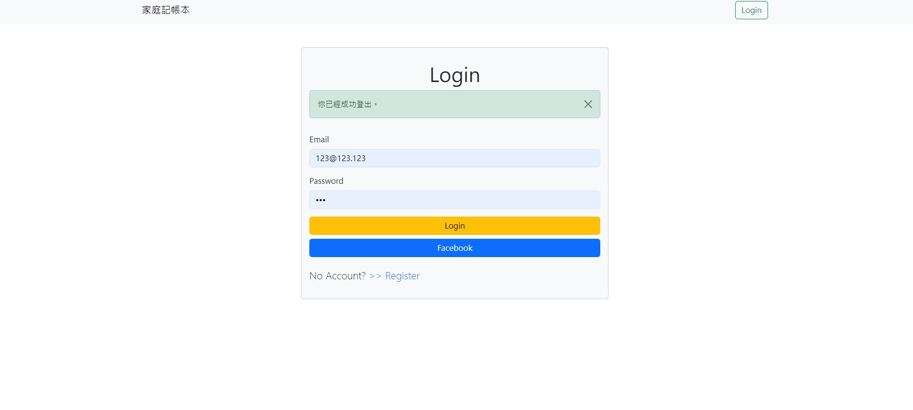
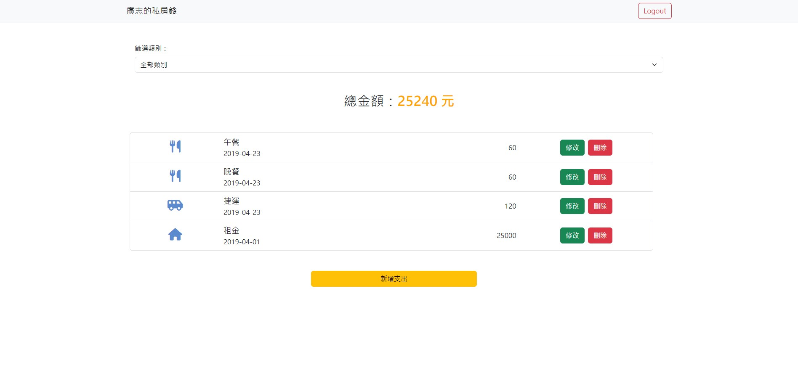

# My Restaurant List



## Project Introduction
This project provides users with a platform to record and manage their expenses. Users can perform functions like adding, deleting, editing, and filtering expenses.

## Features
* Users can choose to log in or sign up using their email or Facebook account.
* After logging in, users can view all expense items on the main page.
* Users can add and delete expense items.
* Users can edit the content of an expense item.
* Expense items include fields for expense name, date, category, and amount.
* Users can filter expenses by category to view the total amount spent in each category.

## Getting Started
1. Make sure Node.js and npm are installed on your local machine.
2. Open the terminal and clone this project to your local machine using the following command:
  ```
  $ git clone https://github.com/Nilney/expense-tracker.git
  ```
3. Navigate to the project folder:
  ```
  $ cd expense-tracker
  ```
4. Install the necessary npm packages by running the following command:
  ```
  $ npm install
  ```
5. Create a .env file based on the .env.example file and set your environment variables in the SKIP section:
  ```
  MONGODB_URI=SKIP
  FACEBOOK_ID=SKIP
  FACEBOOK_SECRET=SKIP
  FACEBOOK_CALLBACK=http://localhost:3000/auth/facebook/callback
  PORT=3000
  SESSION_SECRET=SKIP
  ```
6. You can use the provided seed script to populate the database:
  ```
  $ npm run seed
  ```
| User | Email             | Password |
| :---:| :---------------: | :------: |
| 廣志 | user1@example.com | 12345678 |
| 小新 | user2@example.com | 12345678 |
7. Start the project by running the following command:
  ```
  $ npm run start
  ```
8. When you see the following message, the project is successfully running. You can access the application by entering the URL in your browser:
  ```
  App is running on http://localhost:3000
  ```
9. To stop the application, press ctrl + c.
  ```
  $ ctrl + c
  ```

## 開發工具
- bcryptjs: 2.4.3,
- body-parser: 1.20.2,
- connect-flash: 0.1.1,
- express: 4.18.2,
- express-handlebars: 5.3.3,
- express-session: 1.17.1,
- font-awesome: 4.7.0,
- method-override: 3.0.0,
- mongodb: 5.6.0,
- mongoose: 5.9.7,
- nodemon: 2.0.22,
- passport: 0.4.1,
- passport-facebook: 3.0.0,
- passport-local: 1.0.0

### 開發人員
[Harrison](https://github.com/Harrison0502)